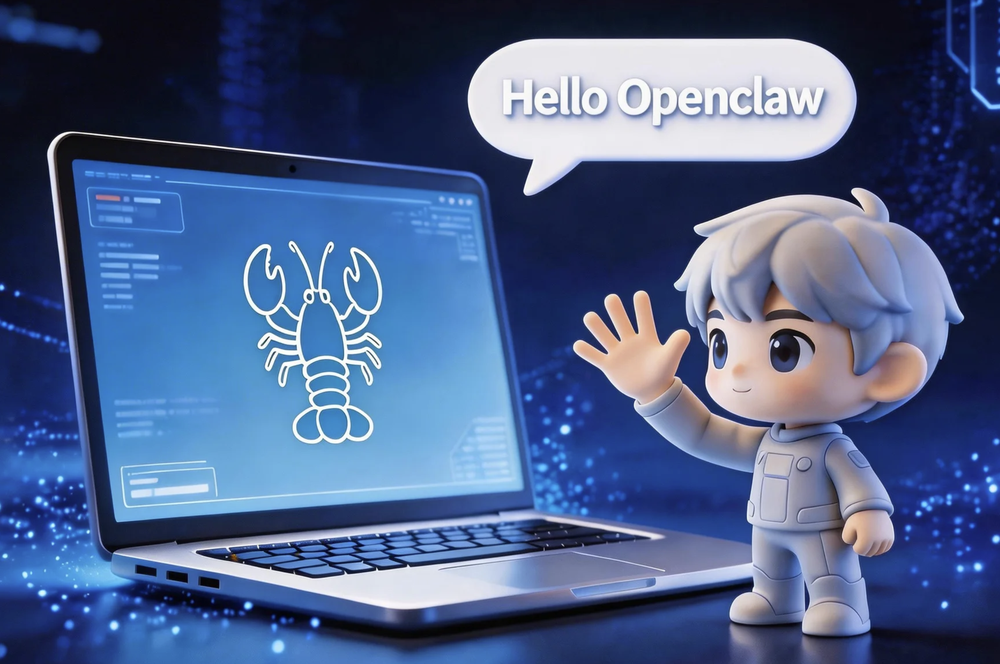
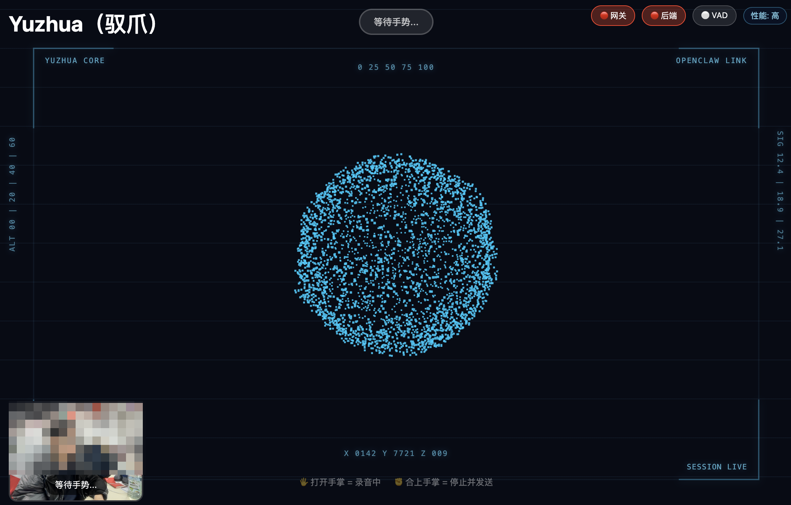

# Yuzhua（驭爪）

[English](README.md) | 中文

Yuzhua 是一个轻量的手势驱动 AI 助手 Web 应用。  
打开手掌开始录音，合上手掌结束录音，并通过 OpenClaw 完成 AI 对话。



## Demo



## OpenClaw 安装与接入（建议先完成）

在运行 Yuzhua 前，请先确保 OpenClaw 已安装并启动网关。

1. 在本机安装并启动 OpenClaw。
2. 确认 OpenClaw Gateway 可访问（默认：`ws://127.0.0.1:18789`）。
3. 从 OpenClaw 侧获取 operator token。
4. 创建本地配置文件：

```bash
cp .env.example .env
```

5. 填写 `.env`：

```env
OPENCLAW_GATEWAY_URL=ws://127.0.0.1:18789
OPENCLAW_TOKEN=your_openclaw_token
OPENCLAW_SESSION_KEY=
```

`OPENCLAW_SESSION_KEY` 可以留空，Yuzhua 会自动生成。

## 功能特性

- 🤚 手势控制：打开手掌开始录音，合上手掌停止录音
- 🎙️ 语音转文字：本地 Whisper + 本地 Silero VAD
- 💬 AI 对话：通过 OpenClaw Gateway 对接
- 🔊 语音播报：Edge TTS 播放回复
- ✨ 视觉反馈：Three.js 粒子动画
- 🔐 会话隔离：使用独立 `sessionKey`，不修改 OpenClaw 运行状态

## 技术架构

| 层级 | 技术 |
|------|------|
| 前端 | HTML + JavaScript + Three.js |
| 手势识别 | MediaPipe Hands（浏览器端） |
| 语音识别 | Whisper（默认 `small`，本地） |
| VAD | Silero VAD（本地） |
| AI 网关 | OpenClaw Gateway（WebSocket） |
| 语音合成 | Edge TTS |
| 后端 | FastAPI（Python） |

## 目录结构

```text
Yuzhua/
├── web_frontend/
│   ├── index.html
│   ├── css/style.css
│   └── js/
│       ├── main.js
│       └── handTracker.js
├── web_server/
│   └── api_server.py
├── transcriber.py
├── gateway_sender.py
├── config.py
├── scripts/bootstrap.py
├── start.sh
└── requirements.txt
```

## 启动方式

```bash
chmod +x start.sh
./start.sh
```

访问地址：`http://localhost:8080`

## 使用说明

1. 打开网页并允许摄像头/麦克风权限
2. 对着摄像头打开手掌（🖐️）开始录音
3. 合上手掌（✊/✋）停止并发送
4. 等待 AI 文本与语音回复

## 环境变量配置

先复制模板：

```bash
cp .env.example .env
```

主要变量：

- `OPENCLAW_GATEWAY_URL`（默认 `ws://127.0.0.1:18789`）
- `OPENCLAW_TOKEN`（除非可自动发现，否则必填）
- `OPENCLAW_SESSION_KEY`（可选，留空自动生成）
- `WHISPER_MODEL_SIZE`（默认 `small`）

## 依赖要求

- Python 3.10+
- ffmpeg
- `requirements.txt` 中的 Python 依赖

## 注意事项

- 首次运行会自动安装依赖并预热/下载模型
- 手势识别与语音识别链路在本地运行
- 当前 TTS 为 Edge TTS（非本地 TTS 模型）

## Star 趋势

[](https://star-history.com/#juguangyuan520-dotcom/Yuzhua&Date)

## 开源协议

[MIT](LICENSE)
